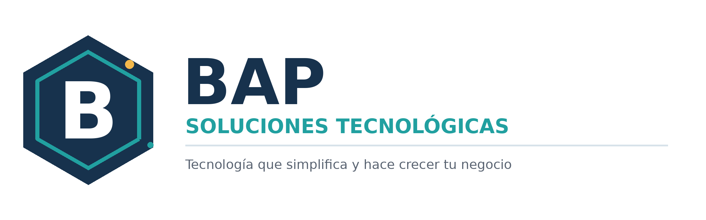
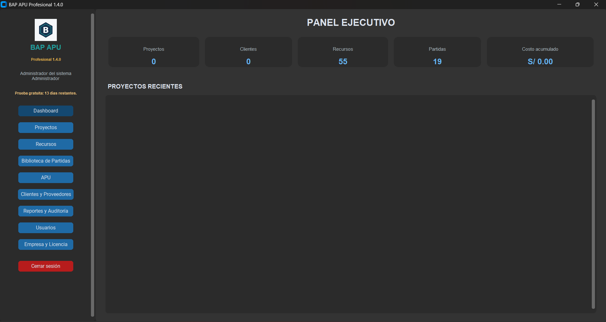
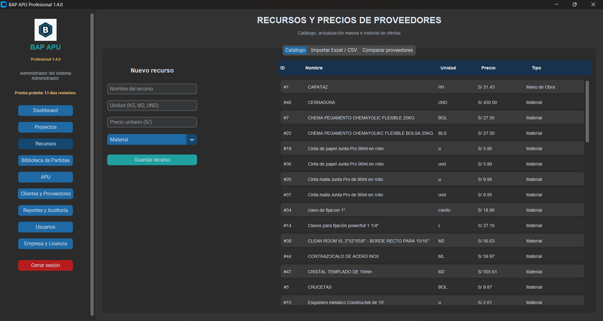
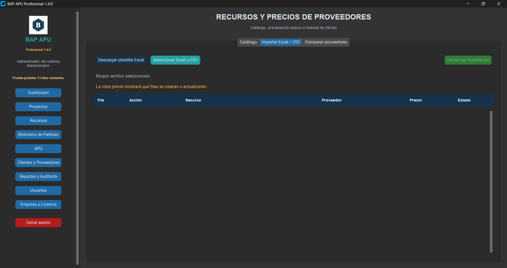
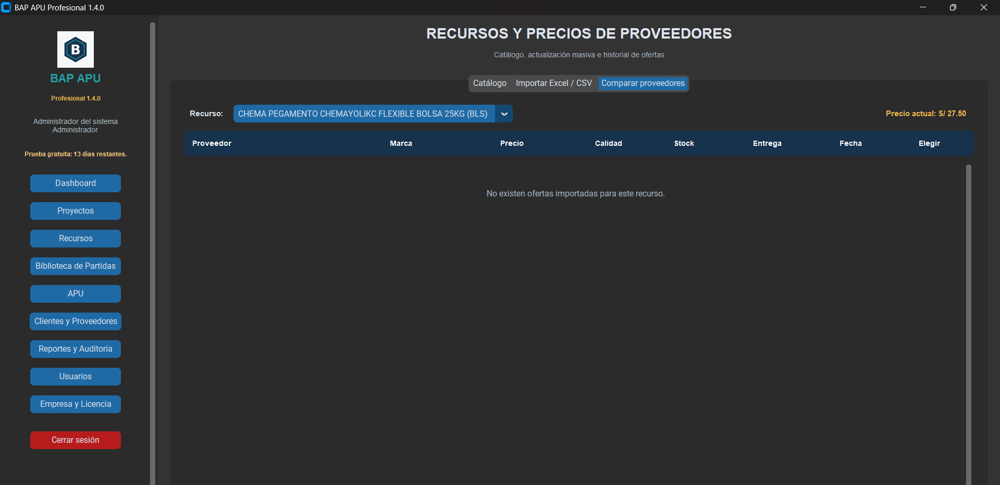
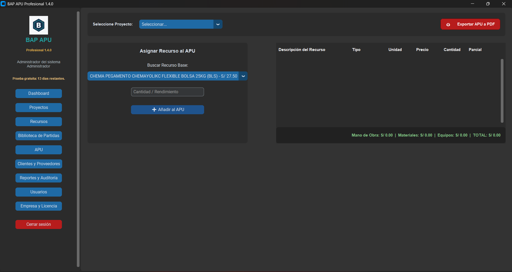

  

# BAP APU Profesional

Aplicativo de escritorio desarrollado por **Brayan Paredes** para gestionar
análisis de precios unitarios, recursos, partidas, proyectos y cotizaciones de
proveedores en empresas constructoras peruanas.

> Producto comercial de BAP Soluciones Tecnológicas. Este repositorio es una
> presentación pública del proyecto y no contiene el código fuente propietario.

## Problema que resuelve

Las empresas que trabajan únicamente con hojas de cálculo pueden terminar con
precios desactualizados, información duplicada, presupuestos difíciles de
auditar y tiempos elevados de preparación. BAP APU Profesional centraliza esta
información y permite generar análisis consistentes y reportes presentables.

## Funciones principales

- Dashboard ejecutivo con proyectos, recursos, partidas y costos acumulados.
- Catálogo centralizado de materiales, mano de obra y equipos.
- Biblioteca de partidas reutilizables.
- Elaboración de APU con subtotales y costo directo.
- Importación y actualización masiva desde Excel o CSV.
- Comparación de proveedores por precio, calidad, stock y entrega.
- Gestión de clientes, proveedores, usuarios, roles y auditoría.
- Exportación profesional de reportes PDF.
- Respaldos verificables y licenciamiento offline por equipo.
- Prueba gratuita y operación sin servidor permanente.

## Capturas del sistema

### Panel ejecutivo

### Recursos y precios

### Importación Excel y CSV

### Comparación de proveedores

### Análisis de precios unitarios

## Tecnologías utilizadas

| Componente | Tecnología |
|---|---|
| Aplicación de escritorio | Python y CustomTkinter |
| Base de datos | SQLite |
| Importaciones | OpenPyXL y CSV |
| Reportes | ReportLab |
| Seguridad | Hash de contraseñas y firmas Ed25519 |
| Empaquetado | PyInstaller |
| Instalador | Inno Setup |
| Pruebas | Unittest |

## Evolución del producto

| Versión | Hito |
|---|---|
| `1.2.0` | Conversión a producto comercial BAP |
| `1.2.1` | Licenciamiento offline y control de usuarios |
| `1.2.2` | Base inicial incorporada al instalador |
| `1.4.0` | Importación Excel/CSV y comparación de proveedores |
| `1.4.0-r1` | Revisión visual, branding y reporte comercial BAP |

## Reporte demostrativo

Puede consultar el [reporte APU de demostración](docs/BAP_APU_Reporte_Demostracion.pdf).

## Autor y contacto

**Brayan Paredes**  
Ingeniería de Sistemas — Lima, Perú  
BAP Soluciones Tecnológicas  
WhatsApp: +51 904 170 143  
Correo: contacto.bapsoluciones@gmail.com  
[Sitio web de BAP](https://bap-soluciones-tecnologicas.quick-spark-9180.chatgpt.site)

## Uso y propiedad intelectual

Este repositorio no concede permiso para copiar, distribuir, comercializar ni
reconstruir el aplicativo. Las imágenes y documentación se publican únicamente
como evidencia técnica y portafolio profesional.
